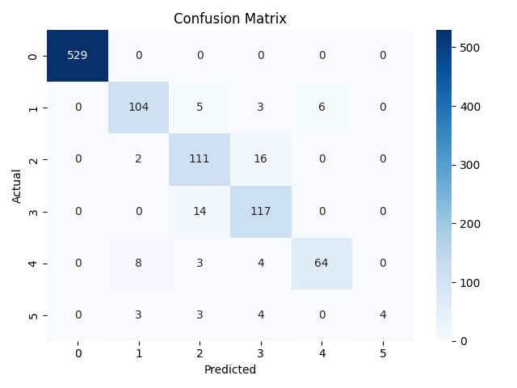

# machine_learning
### Copy this into your `README.md` file:
markdown
#Intelligent Network Traffic Classifier

A machine learning project that classifies network traffic patterns using Random Forest.  
It includes a trained model, evaluation metrics, and an interactive dashboard using Streamlit.

##Project Structure

.
├── app.py                  # Streamlit dashboard
├── ml\_pipeline.py          # ML training & evaluation script
├── train\_dataset.csv       # Input dataset
├── rf\_model.pkl            # Trained Random Forest model
├── scaler.pkl              # Scaler used for feature normalization
├── confusion\_matrix.png    # Model performance heatmap
├── requirements.txt        # Python dependencies
└── README.md


##Model Overview

- **Algorithm**: Random Forest Classifier (n=150 trees)
- **Task**: Multi-class classification of network traffic
- **Input Features**: 31 numeric features
- **Target**: `Label` (0–5)


##  Performance

- **Accuracy**: ~92.8%
- Visual evaluation: 


##  Run the Project

###  Step 1: Install Dependencies

```bash
pip install -r requirements.txt
````

### 📌 Step 2: Train the Model (Optional)

```bash
python ml_pipeline.py
```

### 📌 Step 3: Run the Dashboard

```bash
streamlit run app.py
```

Upload your `.csv` with features and view predictions + class distribution plot.

---

## 📦 Sample Dataset

This project uses a file named `train_dataset.csv` with structured network traffic data.
If you'd like to try it out, use your own `.csv` with similar columns, **excluding the `Label`**.

---

## 🛠 Tech Stack

* Python
* Scikit-learn
* Pandas & NumPy
* Seaborn & Matplotlib
* Streamlit

---

## 📬 Contact

Made by **Teja Bhat**
📧 [Visit Portfolio](https://stejabhat.github.io/portfolio/)

````

---

### ✅ Next Step

1. Save this as a `README.md` file in your project root.
2. Add and push it:

```bash
git add README.md
git commit -m "Add project README"
git push
````

